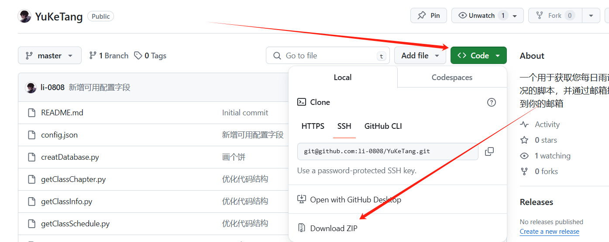
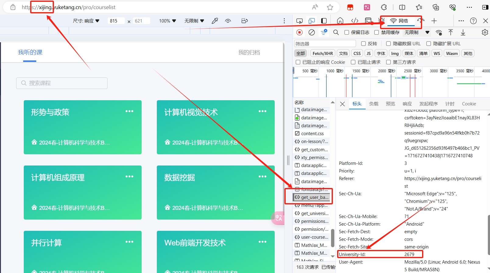

# 依赖环境
- python 3.12 （其他环境没有试过）
- Git（用于下载项目）
# windows
1. 下载压缩包

2. 解压并使用IDE打开项目
3. 安装依赖
    ```python
    pip install -r requirements.txt
    ```
4. 填写配置文件

    [查看配置文件如何填写](#config)

5. 运行
    在IDE中点击【运行】即可
# linux
1. 克隆该项目到服务器
    ```bash
    git clone https://github.com/li-0808/YuKeTang.git
    ```
    国内服务器可使用加速链接↓
    ```bash
    git clone https://mirror.ghproxy.com/https://github.com/li-0808/YuKeTang.git
    ```

2. 进入项目文件
    ```bash
    cd YuKeTang
    ```
3. 安装依赖
    ```python
    pip install -r requirements.txt
    ```
4. 填写配置文件

    [查看配置文件如何填写](#config)

5. 运行
    ```shell
    python ./main.py
    ```
    或者
    ```shell
    python3 ./main.py
    ```

 <span id="config"></span>
 # 配置文件
 ## 不知到怎么获取，可以看下方的[教程](#jiaocheng)
```json
{
  "basic": {
    "school_name": "", # 这里填学校的英文名称eg：xijing
    "school_id": "", # 这里填学校的id
    "cookie": "" # 这里填登陆雨课堂（注意是：xx.yuketang.cn）后的cookie
  },
  "email": {
    "sender": "", # 邮件发件人eg：1688@qq.com用来发邮件的账号
    "receiver": "", # 邮件收件人eg：1234@qq.com（你自己用来接收信息的号）
    "host": "smtp.qq.com", # 发邮主机 默认QQ
    "port": "465", # 发邮端口，默认QQ
    "user": "", # 发送邮箱用的用户名 eg：1688@qq.com（用来发邮件的账号）
    "password": "" # 发送邮箱用的密码（用来发邮件账号的密码）
  },
  "other": {
    "wait_time": 0 # 每次获取课程信息后的等待时间
  }
}
```
 <span id="jiaocheng"></span>
## 获取教程

1. 登录到 `你的学校名.yukeng.com` 并登陆
2. F12打开控制台 打开网络面板>刷新页面>找一个{;}图标的点进去
3. `school_id` 就是图中的 `University-ld`
4. `cookie` 就是 `Cookie:`字段 右边一大段字符，全部都要复制
5.关于`email`部分，默认使用QQ的，你也可以使用其他邮箱，网上相关文章很多自行搜索


